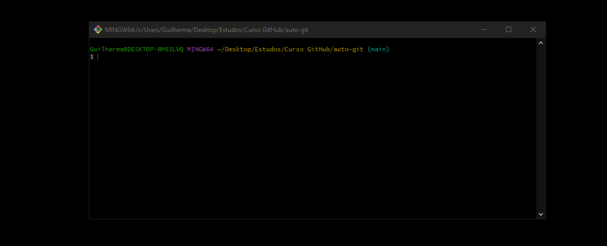

## 📄 `README.md` EM PORTUGUÊS

# 🧠 GitMenu – Automação de Branches via Terminal

Uma ferramenta interativa no terminal para gerenciar branches do Git de forma rápida, segura e visual. Troque, faça merge e exclua branches com menus coloridos usando [FZF](https://github.com/junegunn/fzf), com pré-visualização ao vivo e interface amigável para todos os níveis de usuário.

---

## 🚀 Funcionalidades

✅ Trocar de branch com visualização do log  
✅ Fazer merge entre branches com preview de diferenças (diff)  
✅ Deletar branches com confirmação e preview  
✅ Interface 100% em inglês para uso universal  
✅ Detecção automática se o diretório não é um repositório Git  
✅ Cores destacadas para melhorar a navegação  
✅ Feito com Shell Script puro + FZF + Git

---

## 🖼️ Exemplo visual 


---

## 📦 Instalação

### 1. Clone este repositório

```bash
git clone https://github.com/Guilherme-dev15/git-automation-tool.git
cd git-automation-cli
```
### 2. Torne o script executável e mova para o PATH

```bash
chmod +x gitmenu
mv gitmenu ~/.local/bin/
```

> Se necessário, adicione o caminho ao `.bashrc` ou `.zshrc`:

```bash
export PATH="$HOME/.local/bin:$PATH"
```

### 3. Execute de qualquer lugar:

```bash
gitmenu
```

---

## 🧩 Pré-requisitos

* **Git instalado**
* **fzf** instalado ([Guia oficial](https://github.com/junegunn/fzf#installation))
* Terminal compatível com ANSI colors (ex: bash, zsh)

---

## 🛠️ Como funciona

| Ação               | O que faz                                                                          |
| ------------------ | ---------------------------------------------------------------------------------- |
| 🔁 Trocar branch   | Lista todas as branches com pré-visualização do log da selecionada                 |
| 🔀 Merge de branch | Permite escolher uma branch para fazer merge na atual, mostrando diferenças (diff) |
| 🗑️ Deletar branch | Remove uma branch local com preview e confirmação                                  |
| 🚪 Sair            | Encerra o programa com mensagem amigável                                           |
| 🧪 Validação       | Verifica se o diretório atual é um repositório Git válido                          |

---

## 📘 Exemplo de fluxo

```bash
# Você está em develop e quer enviar para produção

git add .
git commit -m "Finalizei a feature"

gitmenu  # Escolhe Switch → main
gitmenu  # Escolhe Merge → develop
git push origin main
```

---

## 📂 Organização do código

```
.
├── gitmenu          # Script principal
├── README.md        # Documentação do projeto
t Automation CLI – `gitmenu`

An interactive Git branch management tool built with Bash + FZF.  
Ideal for developers who want a faster, cleaner and safer way to switch, merge or delete branches — with live previews, color UI, and full Git validation.


---

## 🚀 Features

- ✅ Switch branches with live log previews  
- ✅ Merge branches with visual `git diff` preview  
- ✅ Delete branches with confirmation and history preview  
- ✅ Detects if you're inside a valid Git repository  
- ✅ Fully color-coded and keyboard-navigable with FZF  
- ✅ Shell Script only — no Node, Python, or dependencies  
- ✅ 100% English UI, beginner and team-friendly  

---

## 🛠️ Why it matters

**Tired of memorizing Git commands or dealing with merge conflicts without context?**  
This tool simplifies branch navigation and merging while remaining 100% terminal-native.

No aliases, no wrappers. Just clean Bash with `fzf`.

---

## 💻 How it works

| Action        | Description                                                             |
|---------------|-------------------------------------------------------------------------|
| 🔁 Switch      | Browse all local branches with log preview before switching             |
| 🔀 Merge       | Choose a branch to merge into the current one, with visual `git diff`   |
| 🗑️ Delete      | Safely delete local branches with preview and confirmation              |
| 🚪 Exit        | Gracefully exits the tool                                               |
| 🧪 Validate    | Ensures you're inside a Git project before running any command          |

---

## ⚡ Quick Demo (Typical Use Case)

```bash
# You're in 'develop' and want to push changes to 'main'

git add .
git commit -m "Finish feature"

gitmenu        # Choose 🔁 Switch to 'main'
gitmenu        # Choose 🔀 Merge 'develop' into 'main'
git push origin main
📦 Installation
1. Clone the repository
bash
Copy
Edit
git clone https://github.com/Guilherme-dev15/git-automation-tool.git
cd git-automation-tool
2. Make it executable and install
bash
Copy
Edit
chmod +x gitmenu
mv gitmenu ~/.local/bin/
Ensure ~/.local/bin is in your $PATH. If not, add this to your ~/.bashrc or ~/.zshrc:

bash
Copy
Edit
export PATH="$HOME/.local/bin:$PATH"
3. Run from anywhere
bash
Copy
Edit
gitmenu
🧩 Requirements
Git

fzf

Bash 4+

Linux, WSL or macOS terminal

📁 Project Structure
bash
Copy
Edit
.
├── gitmenu          # Main script (auto-git.sh renamed)
├── README.md        # Project documentation
├── demo.gif         # Visual demo of usage
```
